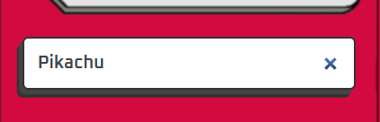
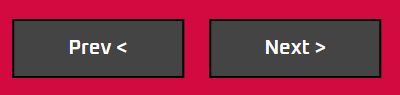

# 😺 Pokedex

Um repositório criado inicialmente para aprender como funciona o **HTML**, **CSS** e **JS** juntos. O projeto foi refeito por ter varios erros, não ter uma estrutura mais amigavel de pastas e falta de prática de código limpo. Ainda pretendo expadi-lo futuramente, adicionando novas informações a cada pokemon e se possivel fazer com ReactJs. 😀

---
 

## 📁 Estrutura de Pastas

| Pastas e Arquivos | Descrição                              |
|-------------------|----------------------------------------|
| .vscode/          | Configurações do editor                |
| src/              | Recursos para o site (js, css, imagens, etc)                                                         |
| .editorconfig     | Padrões de formatação                  |

---
 

## ⚙️ Tecnologias

- HTML
- CSS
- JavaScript
- API's
- Git

---
 

## 🤔 Como Usar?

### 1. Como usar o input

Para procurar o *pokemon* atraves do **input**, primeiro você precisa de uma das informações `(Nome ou Id)`. Coloque umas das informações dentro do **Input** e use a tecla **enter**.

### 2. Como usar os botões (Prev e Next)

Os pokemons tem **identificadores(id)**, por exemplo, o *Pikachu usa o id 25*. O botão `PREV` ele vai para o identificador anterior, ele retrocede um. Já o botão `NEXT` faz ao contrário, ele vai para o identificador seguinte, ele avança um.

> Versão 1.0.1

